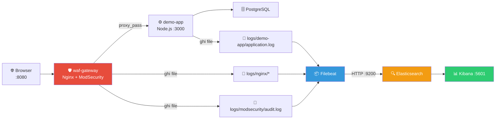

# Phân Tích ELK Stack — Dự án ModSecurity WAF

> **Phiên bản stack:** Elasticsearch 8.17.3 · Kibana 8.17.3 · Filebeat 8.17.3

---

## 1. Tổng Quan ELK Stack

**ELK** là bộ ba công cụ mã nguồn mở của **Elastic** dùng để thu thập, lưu trữ, tìm kiếm và trực quan hoá log:

| Thành phần                  | Vai trò                    | Ví von                                   |
| --------------------------- | -------------------------- | ---------------------------------------- |
| **Elasticsearch**           | Search engine & lưu trữ    | "Bộ não" — index, tìm kiếm full-text     |
| **Logstash** / **Filebeat** | Thu thập & chuyển tiếp log | "Hệ thần kinh" — đọc file, parse, gửi đi |
| **Kibana**                  | Dashboard & trực quan hoá  | "Mắt" — biểu đồ, bảng, bộ lọc tương tác  |

> [!NOTE]
> Dự án này dùng **Filebeat** thay vì Logstash. Filebeat nhẹ hơn (~10 MB RAM), phù hợp cho việc tail file log rồi ship thẳng vào Elasticsearch mà không cần pipeline transform phức tạp.

---

## 2. Kiến Trúc Triển Khai Trong Dự Án



### Luồng dữ liệu (Data Flow)

1. **Browser** gửi request đến port `8080` (waf-gateway).
2. **Nginx + ModSecurity** kiểm tra CRS rules → cho phép hoặc chặn (403).
3. Request hợp lệ được proxy tới **demo-app** (Node.js :3000).
4. Cả 3 service ghi log ra file trên volume mount chung `./logs/`.
5. **Filebeat** tail các file log, parse JSON (ndjson), gắn metadata (`serviceName`, `source_type`, `environment`).
6. Filebeat đẩy event vào **Elasticsearch** qua REST API port 9200.
7. **Kibana** (port 5601) query Elasticsearch để hiển thị dashboard.

---

## 3. Chi Tiết Từng Thành Phần

### 3.1 Elasticsearch

**Cấu hình** (từ `docker-compose.yml`):

```yaml
elasticsearch:
  image: docker.elastic.co/elasticsearch/elasticsearch:8.17.3
  environment:
    discovery.type: single-node # Chạy 1 node duy nhất
    xpack.security.enabled: 'false' # Tắt bảo mật (demo)
    ES_JAVA_OPTS: -Xms512m -Xmx512m # Giới hạn JVM heap 512 MB
  ports:
    - '9200:9200'
  volumes:
    - elasticsearch-data:/usr/share/elasticsearch/data
```

**Tính năng chính:**

- **Full-text search** — tìm kiếm log theo nội dung, regex, wildcard
- **Inverted index** — index ngược giúp query nhanh trên hàng triệu document
- **RESTful API** — mọi thao tác qua HTTP JSON (CRUD, search, aggregation)
- **Index pattern** — `modsecurity-demo-YYYY.MM.DD` (1 index/ngày, dễ quản lý retention)
- **Aggregations** — thống kê, group by, histogram theo thời gian

### 3.2 Filebeat (thay Logstash)

**Cấu hình** (từ `filebeat/filebeat.yml`):

4 input streams được cấu hình:

| Input ID                 | Path                                    | Parser         | source_type |
| ------------------------ | --------------------------------------- | -------------- | ----------- |
| `demo-app-logs`          | `/workspace/logs/demo-app/*.log`        | ndjson         | application |
| `nginx-access-logs`      | `/workspace/logs/nginx/access.log`      | ndjson         | access      |
| `nginx-error-logs`       | `/workspace/logs/nginx/error.log`       | _(plain text)_ | error       |
| `modsecurity-audit-logs` | `/workspace/logs/modsecurity/audit.log` | ndjson         | audit       |

**Điểm quan trọng:**

- Mỗi input có `id` duy nhất để Filebeat theo dõi offset (không đọc lại log cũ)
- `fields_under_root: true` → các field `serviceName`, `source_type` nằm ở root document
- Processor `add_fields` gắn `environment: local-demo` cho mọi event
- Output ghi vào index `modsecurity-demo-%{+yyyy.MM.dd}`

### 3.3 Kibana

**Cấu hình** (từ `docker-compose.yml`):

```yaml
kibana:
  image: docker.elastic.co/kibana/kibana:8.17.3
  environment:
    ELASTICSEARCH_HOSTS: http://elasticsearch:9200
    XPACK_SECURITY_ENABLED: 'false'
  ports:
    - '5601:5601'
```

**Tính năng chính:**

- **Discover** — duyệt log thô, lọc theo field, full-text search
- **Dashboard** — tạo biểu đồ tổng hợp (pie chart, bar, line, metric)
- **Lens / Visualize** — kéo thả tạo visualization
- **KQL** — cú pháp query: `status: 403 AND uri: "/api/search"`
- **Time picker** — chọn khoảng thời gian phân tích

---

## 4. So Sánh Logstash vs Filebeat

| Tiêu chí      | Logstash                       | Filebeat               |
| ------------- | ------------------------------ | ---------------------- |
| **Ngôn ngữ**  | JRuby (JVM)                    | Go                     |
| **RAM**       | 500 MB – 1 GB+                 | 10 – 50 MB             |
| **Transform** | Mạnh (grok, mutate, geoip)     | Cơ bản (processors)    |
| **Use case**  | Pipeline phức tạp, nhiều nguồn | Ship log file đơn giản |
| **Dự án này** | ❌ Không dùng                  | ✅ Phù hợp             |

---

## 5. Phân Tích File Log Thực Tế

### Tổng quan dữ liệu

| File log          | Đường dẫn                       | Kích thước | Số dòng | Định dạng     |
| ----------------- | ------------------------------- | ---------- | ------- | ------------- |
| Nginx Access      | `logs/nginx/access.log`         | 1.4 MB     | 8,272   | JSON (ndjson) |
| Nginx Error       | `logs/nginx/error.log`          | 91 KB      | 146     | Plain text    |
| ModSecurity Audit | `logs/modsecurity/audit.log`    | 783 KB     | 133     | JSON (ndjson) |
| Demo App          | `logs/demo-app/application.log` | 1.4 MB     | 5,746   | JSON (ndjson) |

---

### 5.1 Nginx Access Log

**Cấu trúc một entry:**

```json
{
	"timestamp": "2026-04-08T05:27:45+00:00",
	"serviceName": "waf-gateway",
	"requestId": "8d468f3089f7477bf3a422e5d4b153b4",
	"remoteAddr": "172.22.0.1",
	"method": "GET",
	"uri": "/health",
	"status": 200,
	"bytesSent": 296,
	"userAgent": "curl/8.12.1",
	"upstreamAddr": "172.22.0.5:3000",
	"upstreamStatus": "200",
	"requestTime": 0.028
}
```

**Phân bố HTTP status:**

|        Status | Số lượng | Tỷ lệ |
| ------------: | -------: | ----: |
|      200 (OK) |    1,166 | 93.6% |
| 403 (Blocked) |       80 |  6.4% |

**Top URI bị chặn (403):**

| Số lượng | URI                                | Lý do                            |
| -------: | ---------------------------------- | -------------------------------- |
|       28 | `/favicon.ico`                     | False positive (Supabase cookie) |
|       27 | `/`                                | False positive (Supabase cookie) |
|        9 | `/api/search`                      | SQLi payload                     |
|        4 | `/api/search?q=' OR 1=1 --`        | SQLi attack                      |
|        4 | `/api/login`                       | Brute-force attempt              |
|        4 | `/api/files?file=../../etc/passwd` | Path traversal                   |
|        4 | `/api/comment`                     | XSS/injection                    |

---

### 5.2 Nginx Error Log

**Mẫu entry:**

```
2026/04/08 05:27:45 [error] 570#570: *5 [client 172.22.0.1]
  ModSecurity: Access denied with code 403 (phase 2).
  [id "949110"]
  [msg "Inbound Anomaly Score Exceeded (Total Score: 5)"]
  [uri "/api/search"]
```

**Phân bố Anomaly Score:**

| Score | Số lần | Mức độ                 |
| ----: | -----: | ---------------------- |
|     5 |     70 | 🟡 Thấp (1 rule match) |
|     8 |      4 | 🟠 Trung bình          |
|    15 |      3 | 🔴 Cao                 |
|    20 |      2 | 🔴 Cao                 |
|    23 |      8 | 🔴 Rất cao             |
|    33 |      4 | 🔴 Nghiêm trọng        |

> [!IMPORTANT]
> Ngưỡng chặn (`ANOMALY_INBOUND`) = **5**. Score 33 cho thấy request chứa nhiều vector tấn công cùng lúc.

---

### 5.3 ModSecurity Audit Log

**Cấu trúc (JSON chi tiết — ghi lại toàn bộ request/response khi bị chặn):**

```json
{
	"transaction": {
		"client_ip": "172.22.0.1",
		"unique_id": "177562606537.369113",
		"request": {
			"method": "POST",
			"uri": "/api/search",
			"headers": { "Host": "...", "User-Agent": "..." }
		},
		"response": { "http_code": 403 },
		"producer": {
			"modsecurity": "ModSecurity v3.0.14",
			"components": ["OWASP_CRS/4.25.0"]
		},
		"messages": [
			{
				"message": "SQL Injection Attack Detected via libinjection",
				"details": {
					"ruleId": "942100",
					"data": "Matched Data: s&1c found within ARGS: q=' OR 1=1 --",
					"severity": "2",
					"tags": ["attack-sqli", "paranoia-level/1", "OWASP_CRS"]
				}
			}
		]
	}
}
```

**Phân bố loại tấn công:**

| Số lần | Loại tấn công                  |
| -----: | ------------------------------ |
|     60 | Remote Command Execution (RCE) |
|     25 | Host header is numeric IP      |
|     18 | Path Traversal (`/../`)        |
|     16 | SQLi in login (custom rule)    |
|     14 | SQL Injection via libinjection |
|     10 | XSS via libinjection           |
|     10 | XSS: Script Tag Vector         |
|     10 | NoScript XSS InjectionChecker  |
|     10 | Javascript method detected     |
|      7 | Missing admin token (custom)   |
|      7 | Malformed admin token (custom) |
|      4 | OS File Access Attempt         |
|      4 | Unix Shell Code Found          |
|      4 | Track login attempts by IP     |

---

### 5.4 Demo App Application Log

**Mẫu entry:**

```json
{
	"@timestamp": "2026-04-08T04:30:23.425Z",
	"service": "demo-app",
	"level": "warn",
	"event": "security.decision",
	"requestId": "19e7e957-745f-4d1d-9471-0ff70b0fbfd4",
	"endpoint": "/api/search",
	"decision": "BLOCK",
	"statusCode": 403,
	"matchedRuleIds": ["942100"]
}
```

**Phân bố quyết định bảo mật:**

| Decision  | Số lượng | Tỷ lệ |
| --------- | -------: | ----: |
| **BLOCK** |      174 | 55.9% |
| **ALLOW** |      137 | 44.1% |

**Rule match phổ biến nhất:**

| Số lần | Rule ID         | Mô tả                          |
| -----: | --------------- | ------------------------------ |
|     54 | `942100`        | SQL Injection (libinjection)   |
|     43 | `930120`        | Path Traversal                 |
|     29 | `APP-ADMIN-000` | Missing admin token (custom)   |
|     27 | `941100`        | XSS (libinjection)             |
|     21 | `APP-ADMIN-001` | Malformed admin token (custom) |

---

## 6. Request Tracing End-to-End

Nhờ field `requestId` / `X-Request-ID`, trace 1 request qua cả 4 file log:

```
┌─────────────────────────────────────────────────────────────┐
│  Nginx Access Log    →  requestId: "f54f..."  status: 403  │
│  Nginx Error Log     →  unique_id: "17756..."  rule: 949110│
│  ModSecurity Audit   →  unique_id: "17756..."  SQLi detail │
│  Demo App Log        →  requestId: "19e7..."   BLOCK       │
└─────────────────────────────────────────────────────────────┘
```

> [!TIP]
> Trong Kibana Discover, dùng KQL: `requestId: "f54f541b*"` để tìm tất cả event liên quan.

---

## 8. Nhóm Các Field Quan Trọng Trong Dashboard

Khi xây dựng dashboard trong Kibana, nên nhóm các field theo **mục đích phân tích** để dễ đọc và phản ứng nhanh. Dưới đây là 5 nhóm được đề xuất:

### 8.1 Nhóm 1 — Định Danh & Truy Vết (Identification)

> Trả lời: **"Request nào? Từ đâu? Đi đâu?"**

| Field                   | Nguồn       | Kiểu    | Mục đích                    |
| ----------------------- | ----------- | ------- | --------------------------- |
| `requestId`             | Access, App | keyword | Trace xuyên suốt hệ thống   |
| `transaction.unique_id` | Audit       | keyword | ID duy nhất của ModSecurity |
| `remoteAddr`            | Access      | ip      | IP nguồn của client         |
| `transaction.client_ip` | Audit       | ip      | IP nguồn (xác nhận chéo)    |
| `uri` / `endpoint`      | Access, App | keyword | Endpoint bị truy cập        |
| `method`                | Access, App | keyword | HTTP method (GET/POST/...)  |

**Visualization đề xuất:**

- **Data Table** — liệt kê chi tiết từng request với requestId, IP, URI
- **Pie Chart** — phân bố method (GET vs POST vs PUT...)

**KQL mẫu:**

```
requestId: "8d468f30*" AND source_type: "access"
```

---

### 8.2 Nhóm 2 — Quyết Định Bảo Mật (Security Decision)

> Trả lời: **"Có bị chặn không? Rule nào match? Nguy hiểm mức nào?"**

| Field                                   | Nguồn  | Kiểu    | Mục đích                         |
| --------------------------------------- | ------ | ------- | -------------------------------- |
| `status`                                | Access | integer | HTTP status (200/403/...)        |
| `decision`                              | App    | keyword | ALLOW hoặc BLOCK                 |
| `matchedRuleIds`                        | App    | array   | Danh sách rule CRS đã match      |
| `transaction.messages.message`          | Audit  | text    | Mô tả tấn công chi tiết          |
| `transaction.messages.details.ruleId`   | Audit  | keyword | Rule ID cụ thể                   |
| `transaction.messages.details.severity` | Audit  | integer | Mức nghiêm trọng (0-7)           |
| `transaction.messages.details.tags`     | Audit  | array   | Tag phân loại (attack-sqli, ...) |
| `level`                                 | App    | keyword | Log level (info/warn/error)      |

**Visualization đề xuất:**

- **Metric** — tổng số BLOCK vs ALLOW (hiển thị lớn ở đầu dashboard)
- **Pie Chart** — phân bố theo loại tấn công (`matchedRuleIds`)
- **Bar Chart** — top 10 rule match nhiều nhất
- **Data Table** — chi tiết các request bị BLOCK kèm lý do

**KQL mẫu:**

```
decision: "BLOCK" AND matchedRuleIds: "942100"
status: 403 AND source_type: "access"
```

---

### 8.3 Nhóm 3 — Phân Tích Mạng & Traffic (Network)

> Trả lời: **"Ai truy cập? Bao nhiêu? Từ đâu?"**

| Field                     | Nguồn  | Kiểu    | Mục đích                 |
| ------------------------- | ------ | ------- | ------------------------ |
| `remoteAddr`              | Access | ip      | IP client                |
| `userAgent`               | Access | text    | Trình duyệt / bot / tool |
| `referer`                 | Access | text    | Trang nguồn              |
| `upstreamAddr`            | Access | keyword | Backend đã xử lý         |
| `upstreamStatus`          | Access | keyword | Response từ backend      |
| `bytesSent`               | Access | long    | Dung lượng response      |
| `transaction.client_port` | Audit  | integer | Port nguồn               |

**Visualization đề xuất:**

- **Bar Chart** — top 10 IP truy cập nhiều nhất
- **Pie Chart** — phân bố User-Agent (phát hiện bot/scanner)
- **Line Chart** — traffic theo thời gian (requests/phút)
- **Metric** — tổng bytes gửi đi

**KQL mẫu:**

```
remoteAddr: "172.22.0.1" AND source_type: "access"
userAgent: *curl* OR userAgent: *python*
```

---

### 8.4 Nhóm 4 — Hiệu Năng (Performance)

> Trả lời: **"Nhanh hay chậm? Endpoint nào chậm nhất?"**

| Field                      | Nguồn       | Kiểu    | Mục đích                    |
| -------------------------- | ----------- | ------- | --------------------------- |
| `requestTime`              | Access      | float   | Tổng thời gian xử lý (giây) |
| `timestamp` / `@timestamp` | Access, App | date    | Thời điểm xảy ra            |
| `statusCode`               | App         | integer | HTTP status từ app          |
| `bytesSent`                | Access      | long    | Kích thước response         |

**Visualization đề xuất:**

- **Line Chart** — `requestTime` trung bình theo thời gian
- **Histogram** — phân bố thời gian xử lý
- **Bar Chart** — top 5 endpoint chậm nhất (avg requestTime by uri)
- **Metric** — P95 / P99 response time

**KQL mẫu:**

```
requestTime > 1 AND source_type: "access"
```

---

### 8.5 Nhóm 5 — Metadata & Context (Enrichment)

> Trả lời: **"Log từ service nào? Loại gì? Môi trường nào?"**

| Field                              | Nguồn    | Kiểu    | Mục đích                                                  |
| ---------------------------------- | -------- | ------- | --------------------------------------------------------- |
| `serviceName`                      | Filebeat | keyword | Service gốc (waf-gateway / demo-app)                      |
| `source_type`                      | Filebeat | keyword | Loại log (access/error/audit/application)                 |
| `environment`                      | Filebeat | keyword | Môi trường (local-demo)                                   |
| `event`                            | App      | keyword | Loại sự kiện (http.request.completed / security.decision) |
| `transaction.producer.modsecurity` | Audit    | keyword | Version ModSecurity                                       |
| `transaction.producer.components`  | Audit    | keyword | Version CRS                                               |

**Visualization đề xuất:**

- **Controls** — dropdown filter cho `serviceName`, `source_type`
- **Pie Chart** — phân bố log theo source_type

**KQL mẫu:**

```
serviceName: "waf-gateway" AND source_type: "audit"
```

## Tóm tắt nội dung mới

**5 nhóm field** được đề xuất cho Kibana dashboard:

| #   | Nhóm                     | Câu hỏi trả lời         | Fields chính                                       |
| --- | ------------------------ | ----------------------- | -------------------------------------------------- |
| 1   | **Định Danh & Truy Vết** | Request nào? Từ đâu?    | `requestId`, `remoteAddr`, `uri`, `method`         |
| 2   | **Quyết Định Bảo Mật**   | Có bị chặn? Rule nào?   | `status`, `decision`, `matchedRuleIds`, `severity` |
| 3   | **Phân Tích Mạng**       | Ai truy cập? Bao nhiêu? | `remoteAddr`, `userAgent`, `bytesSent`             |
| 4   | **Hiệu Năng**            | Nhanh hay chậm?         | `requestTime`, `timestamp`                         |
| 5   | **Metadata**             | Log từ service nào?     | `serviceName`, `source_type`, `environment`        |

---

### Bố Cục Dashboard Đề Xuất

```
┌─────────────────────────────────────────────────────────────────┐
│  Row 1: OVERVIEW METRICS                                       │
│  ┌──────────┐ ┌──────────┐ ┌──────────┐ ┌──────────┐          │
│  │ Total    │ │ Blocked  │ │ Avg Time │ │ Top      │          │
│  │ Requests │ │ Requests │ │ (ms)     │ │ Attack   │          │
│  └──────────┘ └──────────┘ └──────────┘ └──────────┘          │
├─────────────────────────────────────────────────────────────────┤
│  Row 2: FILTERS (Controls)                                     │
│  [serviceName ▼] [source_type ▼] [decision ▼] [Time Range]    │
├─────────────────────────┬───────────────────────────────────────┤
│  Row 3: SECURITY        │  TRAFFIC                             │
│  ┌───────────────────┐  │  ┌─────────────────────────────────┐ │
│  │ Attack Type       │  │  │ Requests Over Time (Line)       │ │
│  │ Distribution (Pie)│  │  │                                 │ │
│  └───────────────────┘  │  └─────────────────────────────────┘ │
│  ┌───────────────────┐  │  ┌─────────────────────────────────┐ │
│  │ Top Rules (Bar)   │  │  │ Top IPs (Bar)                   │ │
│  └───────────────────┘  │  └─────────────────────────────────┘ │
├─────────────────────────┴───────────────────────────────────────┤
│  Row 4: DETAIL TABLE                                           │
│  ┌─────────────────────────────────────────────────────────────┐│
│  │ requestId | timestamp | uri | status | decision | ruleIds  ││
│  │ ─────────────────────────────────────────────────────────── ││
│  │ f54f...   | 05:27:45  | /api/search | 403 | BLOCK | 942100││
│  └─────────────────────────────────────────────────────────────┘│
└─────────────────────────────────────────────────────────────────┘
```

> [!TIP]
> Trong Kibana, dùng **Lens** để kéo thả field vào visualization. Chọn **Controls** panel ở row 2 để tạo dropdown filter cho `serviceName` và `source_type` — cho phép lọc toàn bộ dashboard chỉ với 1 click.

---

## 9. Tóm Tắt

### Kết quả phân tích log

- **14,297 dòng log** tổng cộng từ 4 file
- **80 request bị chặn** bởi WAF (6.4% traffic)
- **5 loại tấn công chính**: SQLi, XSS, Path Traversal, RCE, Admin bypass
- **RCE** phổ biến nhất trong audit log (60 lần)
- **SQLi (942100)** match nhiều nhất trong app log (54 lần)
- Anomaly score từ **5 đến 33**

### Điểm mạnh

- ✅ Structured logging (JSON) xuyên suốt pipeline
- ✅ Request ID tracing end-to-end
- ✅ Filebeat nhẹ, cấu hình đơn giản
- ✅ Custom rules bổ sung CRS
